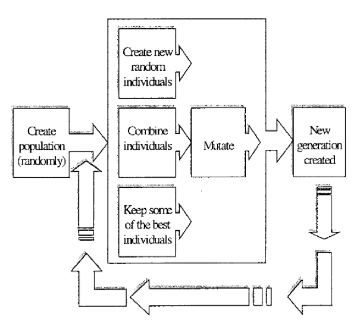
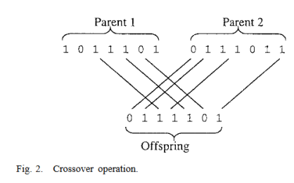
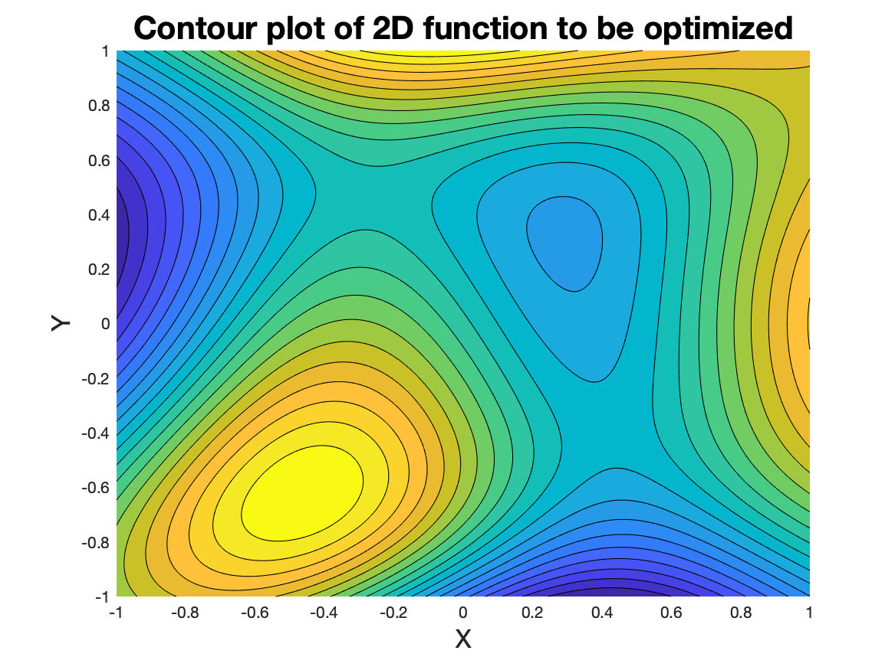
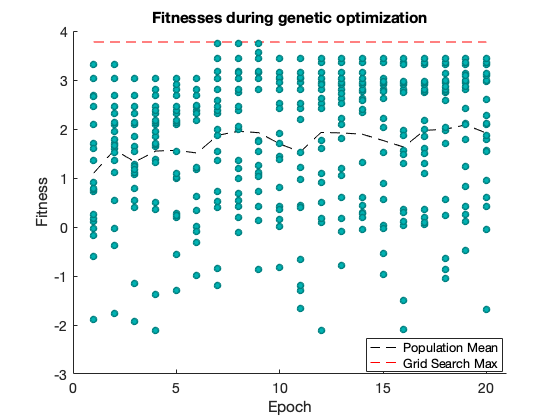

# genetic-opt
## Genetic optimization implemented in Matlab
### Introduction
Optimization of functions with many variables can be difficult, particularly if the function 
landscape contains many local minima, or when analytical optimization is not possible. Genetic 
optimizations introduce randomness that can help avoid local minima, while optimizing
function through a "survival of the fittest" strategy. This
repo implements a simple genetic optimization in Matlab. 

In a genetic optimization, 
a population of function parameters are randomly generated. Some function parameters "mutate" 
(through random replacement of some of their parameters) and some combine with other function
parameters to produce "offspring" parameter sets. At the end of an epoch, the function 
parameters are evaluated on a fitness function. Only a top-scoring fraction of function parameters "survive", 
the rest are discarded.  Unlike stochastic gradient descent, 
the evaluation of fitness functions in genetic optimization can be run in parallel 
(though not implemented in this repo), which can allow for an increase in optimization speed.

The following flowchart, taken from JOURNAL OF LIGHTWAVE TECHNOLOGY, VOL. 16, NO. 10, OCTOBER 1998
"A Genetic Algorithm for the Inverse Problem in Synthesis of Fiber Gratings"
by Johannes Skaar and Knut Magne Risvik, shows the general process of a genetic algorithm. 

The same paper gives illuminating schematics for the crossover and mutation operations: 

### Code description
This code gives a simple implementation of a genetic optimization. Solely for 
ease of visualization and ease of comparison to another optimization technique (grid search),
 the example implemented is only a 2-D function; however, 
the genetic optimization will work best for functions with many more than 
two input variables. 

The contour plot below shows the function we want to optimize. 

Since there are only two variables, X and Y, we can pretty easily optimize this function 
using a grid search. The optimal values within the span of [-1, 1] return as 
x = -0.4582, y = -0.6254. 

Next, we run the genetic algorithm. We introduce 4 additional dummy variables
to make full use of the mutation and combination. We run with the following
hyperparameters: 

    f1 = .20; %Fraction to randomly mutate
    mutate_els = 1; %number of parameter elements to mutate within a parameter set
    f2 = .30; %Fraction to randomly combine
    f3 = .40; %Keep the top f3 fraction for the next iteration
    epochs = 20; %Number of generations to cycle through
    popsize = 20; %Size of the population

The optimization result is plotted below:

To reiterate, this example is a bit silly since we are only optimizing over
two variables; to use genetic optimization at it's full potential, it will 
make most sense to use it for functions of many variables. 
