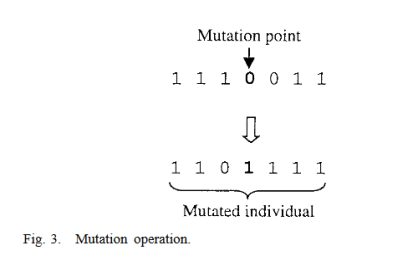

# genetic-opt
## Genetic optimization implemented in Matlab
### Introduction
Optimization of functions with many variables can be difficult, particularly if the function 
landscape contains many local minima, or when analytical optimization is not possible. Genetic 
optimizations introduce randomness that can help avoid local minima, while optimizing
function through a "survival of the fittest" strategy. This
repo implements a simple genetic optimization in Matlab. 

In a genetic optimization, 
a population of function parameters are randomly generated. Some function parameters "mutate" 
(through random replacement of some of their parameters) and some combine with other function
parameters to produce "offspring" parameter sets. At the end of an epoch, the function 
parameters are evaluated on a fitness function. Only a top-scoring fraction of function parameters "survive", 
the rest are discarded.  Unlike stochastic gradient descent, 
the evaluation of fitness functions in genetic optimization can be run in parallel 
(though not implemented in this repo), which can allow for an increase in optimization speed.

The following flowchart, taken from JOURNAL OF LIGHTWAVE TECHNOLOGY, VOL. 16, NO. 10, OCTOBER 1998
"A Genetic Algorithm for the Inverse Problem in Synthesis of Fiber Gratings"
by Johannes Skaar and Knut Magne Risvik, shows the general process of a genetic algorithm. 

The same paper gives illuminating schematics for the crossover and mutation operations: 

### Code description
This code gives a simple implementation of a genetic optimization. 